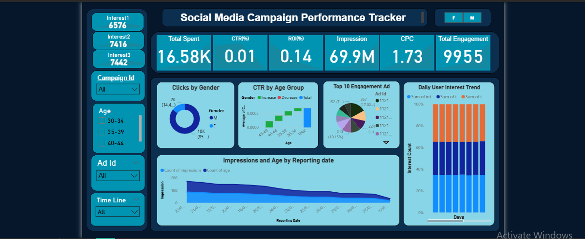

# 📊 Social Media Campaign Performance Tracker

An interactive Power BI dashboard to analyze and visualize ad campaign data from Facebook/Instagram Ads Manager. This project is part of a marketing analytics internship task designed to evaluate and improve the performance of digital ad campaigns.

---

## 🔍 Project Objective

To build a marketing analytics dashboard that answers key business questions:

- How well did the ad campaign perform?
- Which posts or ads had the highest engagement?
- What was the Click-Through Rate (CTR) and Return on Investment (ROI)?
- What can be improved for the next campaign?

---

## 📁 Dataset

- **Source**: [Kaggle - Facebook Ad Campaign Dataset](https://www.kaggle.com/datasets/madislemsalu/facebook-ad-campaign)
- Contains simulated ad campaign performance data including:
  - Gender, Age, Campaign ID
  - Clicks, Impressions, Conversions
  - Cost Per Click (CPC), CTR, Spend

---

## 📈 Key Features & Visuals

### ✅ KPI Cards
- **Total Spent**
- **CTR (%)**
- **ROI (%)**
- **Total Clicks**
- **Impressions**
- **CPC**
- **Total Engagement**

### 📊 Visualizations
- **Clicks by Gender (Donut Chart)**
- **CTR by Age Group (Bar Chart)**
- **Top 10 Engagement by Ad ID (Pie Chart)**
- **Impressions & Age Trend Over Time (Line Area Chart)**
- **Daily User Interest Trend (Stacked Bar Chart)**

### 🎚️ Slicers for Interactivity
- Gender
- Age Group
- Campaign ID
- Ad ID
- Timeline (Reporting Date)

---

## 🧠 Insights & Learnings

- 📌 Campaigns with high impressions don't always translate to high engagement.
- 📌 ROI values vary significantly depending on age group and gender.
- 📌 Most engaged ads tend to be associated with younger audiences.
- 📌 Trends highlight possible days with low performance for optimization.

---

## 🛠️ Tools Used

- **Power BI**
- (Optional/Future) SQL Integration
- Dataset: CSV (from Kaggle)

---

## 🚀 Future Enhancements

- ✅ Connect Power BI to **SQL database** for real-time data tracking
- 🔁 Add dynamic **Assumed Revenue** model to simulate actual ROI
- 📤 Deploy dashboard using **Power BI Service** or embed link in portfolio

---

## 📸 Dashboard Preview

---

## 📄 License

This project is licensed under the MIT License — feel free to use or adapt it.
