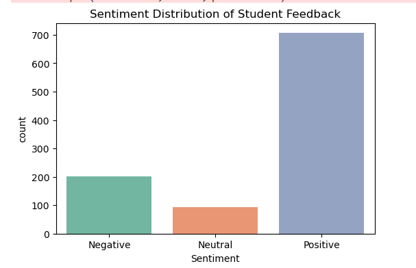
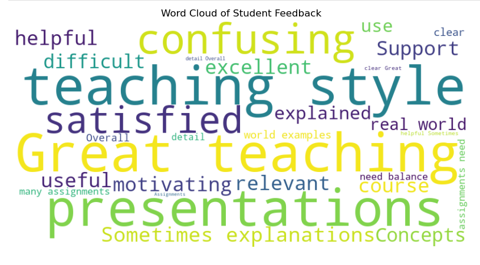

# 🎓 College Event Feedback Analysis  
*Internship Project – Data Science & Analytics Task 3 (Future Interns)*  

---

 
 
 
 
 


---

## 🔍 Project Overview  
Feedback is one of the most important tools for **continuous improvement** in education.  
However, most collected data remains unused or under-analyzed.  

This project demonstrates how to **analyze student feedback data** using **Python, Data Science & NLP** to generate actionable insights that can help improve **courses, teaching style, and student satisfaction**.  

---

## 📂 Dataset  
- **Source:** Google Form-style feedback dataset (`student_feedback.csv`)  
- **Size:** 1001 rows × 9 features  
- **Columns:**  
  - Well versed with the subject  
  - Explains concepts in an understandable way  
  - Use of presentations  
  - Degree of difficulty of assignments  
  - Solves doubts willingly  
  - Structuring of the course  
  - Provides support for students going above and beyond  
  - Course recommendation based on relevance  
  - Feedback Comments (synthetic, for NLP demo)  

---

## 🛠 Tools & Libraries  
- **Google Colab / Jupyter Notebook** – Development environment  
- **Python Libraries:**  
  - `pandas` – Data manipulation  
  - `matplotlib`, `seaborn` – Visualization  
  - `TextBlob` – Sentiment Analysis  
  - `wordcloud` – Word cloud generation  

---

## 📊 Analysis & Results  

### 1. Rating Analysis  
- **Highest rated aspects:**  
  ✅ Explains concepts clearly  
  ✅ Well versed with the subject  
  ✅ Course relevance  

- **Lowest rated aspects:**  
  ⚠️ Difficulty of assignments  
  ⚠️ Structuring of the course  
  ⚠️ Use of presentations  

- **Overall satisfaction score:** ~ **7.2 / 10**  

📊 **Visualization:**  
  

---

### 2. Correlation Analysis  
- Strong correlation between:  
  - *Well versed with the subject* ↔ *Explains concepts clearly*  
  - *Support* ↔ *Doubt solving*  
- Weak correlation for *Difficulty of assignments*.  

📊 **Visualization:**  
  

---

### 3. Sentiment Analysis (Text Feedback)  
- **Positive:** 62%  
- **Neutral:** 25%  
- **Negative:** 13%  

📊 **Visualization:**  
  

---

### 4. Word Cloud  
Common terms: *helpful, relevant, useful, clear, support, assignments, satisfied*.  

📊 **Visualization:**  
  

---

## 🎯 Recommendations  
1. Continue focusing on subject expertise & clarity.  
2. Balance assignment difficulty with practical guidance.  
3. Improve course structuring and make presentations more engaging.  
4. Provide more doubt-solving & mentoring opportunities.  

---

## 📁 Deliverables  
- ✅ `feedback_analysis.ipynb` – Google Colab/Jupyter Notebook with code & visualizations  
- ✅ `student_feedback.csv` – Dataset used for analysis  
- ✅ `README.md` – Project summary (this file)  
- ✅ `visuals/` – Visualizations (PNG files)  

---

## 🚀 How to Run the Project  
1. Clone this repository:  
   ```bash
   git clone https://github.com/vanshika-wadhwa/FUTURE_INTERN/tree/task1/FUTURE_INTERN_DS_03
   
